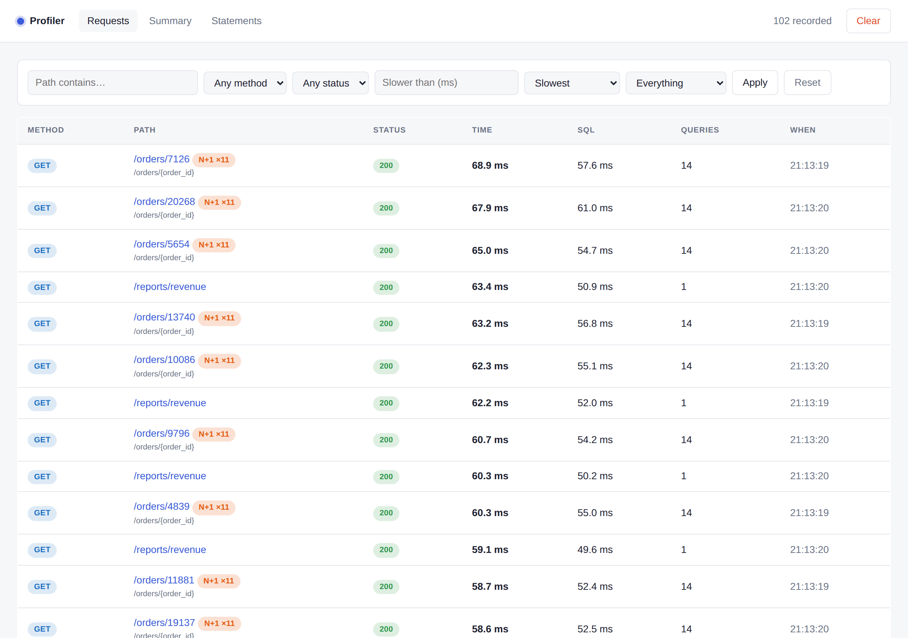
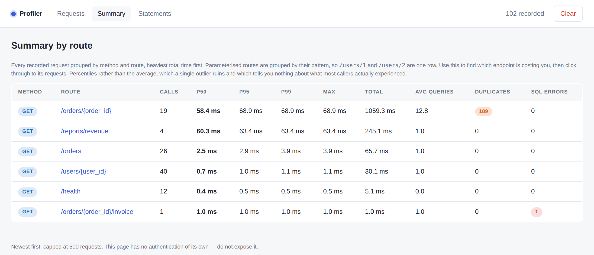

# What it shows

Three pages, plus a detail page per request.

## Requests

Every recorded request, newest first by default. Filter by path, method,
status or duration; sort by slowest, most queries or most SQL time; or narrow
to just the requests with an N+1 or a failed statement.

The route pattern appears under the literal path, so you can see at a glance
that `/orders/17094` was served by `/orders/{order_id}`.

## Request detail

The page that earns the library its keep.

- **Six tiles**: status, total time, time in SQL, time in Python, query count,
  duplicate count.
- **A banner** when statements repeated, because that is the signature of an
  N+1.
- **Every statement**, grouped by SQL text. A group that ran more than once is
  highlighted and badged with its count.
- **A stack per group**, naming the frames in *your* code that issued it —
  with library frames (SQLAlchemy, anyio, asyncio, greenlet, the profiler
  itself) filtered out.

When the same SQL is issued from more than one place, the page says so rather
than implying the single stack explains every execution.

## Summary

Every request grouped by method and route pattern, heaviest total time first.

Percentiles — p50, p95, p99 — rather than the average, which one outlier ruins
and which tells you nothing about what most callers actually experienced.

## Statements

The same statements aggregated across *all* requests, so a query that is only
slightly slow but runs on every endpoint surfaces next to the one dramatic
query on a single page.
