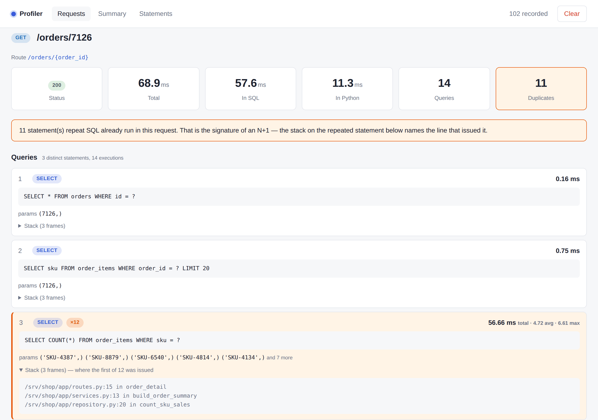

# asgi-profiler

Request and SQL profiling for **ASGI** applications — **Starlette** and
**FastAPI**, with **SQLAlchemy** and **SQLModel**.

```python
from fastapi import FastAPI
from asgi_profiler import install

app = FastAPI()
install(app)  # viewer at /profiler
```

That is the whole integration. No settings module, no database table, no
migration, no external service to run.



One endpoint, 68.9 ms, and 57.6 ms of it inside SQL. The same statement ran
twelve times because a loop asked the database once per line item — and the
stack on that statement names the three frames that did it. That is the point:
not that the request was slow, but which line made it slow.

## What you get

- **Every request**, with its status, duration, and how much of that was SQL.
- **Every statement** it ran, with parameters and timing.
- **N+1 detection.** Statements repeated within one request are grouped and
  flagged, with the call site that issued the first one.
- **Route-pattern grouping.** `/users/1` and `/users/2` aggregate as
  `/users/{user_id}`, so the summary tells you which *endpoint* is slow.
- **Failed statements**, recorded with their error rather than silently lost.
- **Per-query Python stacks**, walked across the greenlet boundary that
  SQLAlchemy's async support puts between your code and the query.

## What it is not

It is not a replacement for OpenTelemetry, Prometheus or a hosted APM, and it
does not try to be. Those answer *"is the service healthy?"* across a fleet,
sampled, with infrastructure behind them. This answers *"why is this endpoint
slow?"* on one process, recording everything, with nothing to deploy.

Run both if you like — they do not collide.

[Install it](getting-started/installation.md){ .md-button .md-button--primary }
[See what it shows](guide/what-it-shows.md){ .md-button }
